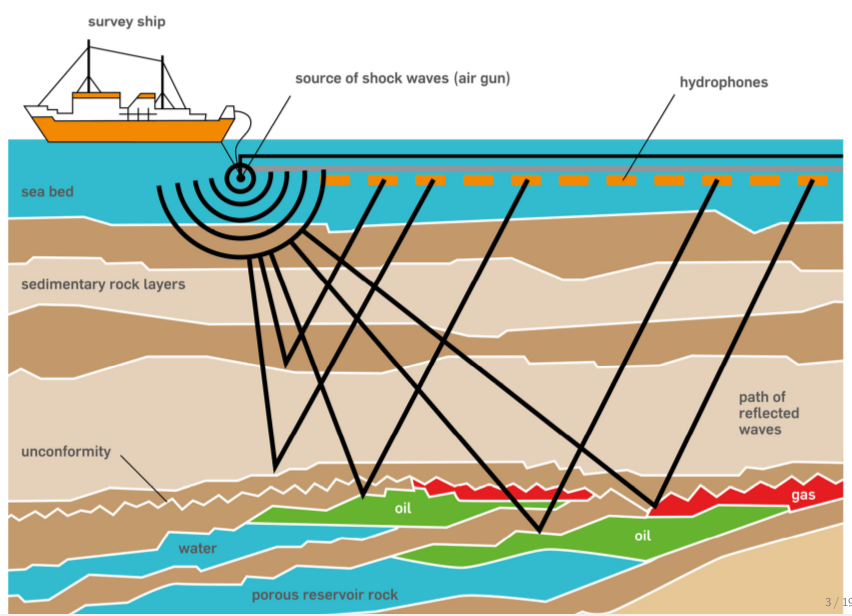
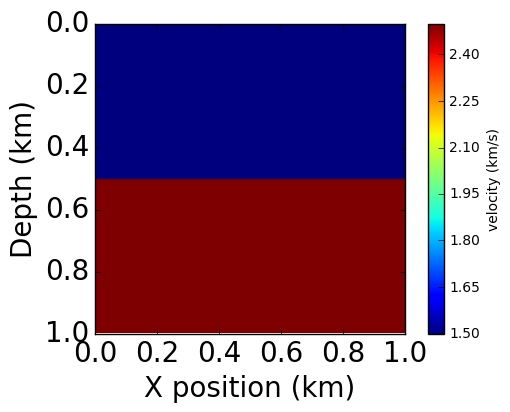
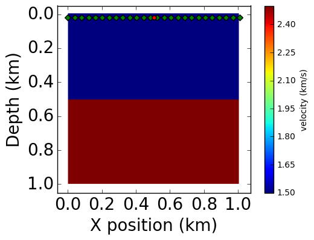
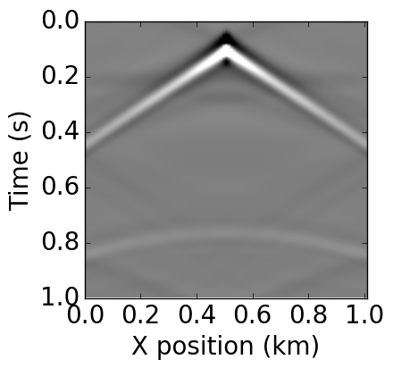

01 - Introduction to seismic modelling
======================================

This notebook is the first in a series of tutorial highlighting various
aspects of seismic inversion based on Devito operators. In this first
example we aim to highlight the core ideas behind seismic modelling,
where we create a numerical model that captures the processes involved
in a seismic survey. This forward model will then form the basis for
further tutorials on the implementation of inversion processes using
Devito operators.

Modelling workflow
------------------

The core process we are aiming to model is a seismic survey, which
consists of two main components:

-  **Source** - A source is positioned at a single or a few physical
   location where artificial pressure is injected into the domain we
   want to modelf. In the case of land survey, it is usually dynamite
   blowing up at a given location, or a vibroseis (a vibrating engine
   generating continuous sound waves). For a marine survey, the source
   is an air gun sending a bubble of compressed air into the water that
   will expand and generate a seismic wave.
-  **Receiver** - A set set of microphones or hydrophones are used to
   measure the resulting wave and create a set of measurements called a
   *Shot Record*. These measurements are recoded at multiple locations,
   and usually at the surface of the domain or at the bottom of the
   ocean in some marine cases.

In order to create a numerical model of a seismic survey, we need to
solve the wave equation and implement source and receiver interpolation
to inject the source and record the seismic wave at sparse point
locations in the grid.

The acoustic seismic wave equation
----------------------------------

The acoustic wave equation for the square slowness :math:`m` defined as
:math:`m=\frac{1}{c^2}`, where :math:`c` is the speed of sound in the
given physical media, and a source :math:`q` is given by:

.. raw:: latex

   \begin{cases}
    &m \frac{d^2 u(x,t)}{dt^2} - \nabla^2 u(x,t) = q \ \text{in } \Omega \\
    &u(.,t=0) = 0 \\
    &\frac{d u(x,t)}{dt}|_{t=0} = 0
   \end{cases}

with the zero initial conditons to guarantee unicity of the solution.
The boundary condtions are Dirichlet conditions :

.. raw:: latex

   \begin{equation}
    u(x,t)|_\delta\Omega = 0
   \end{equation}

where :math:`\delta\Omega` is the surface of the boundary of the model
:math:`\Omega`.

Finite domains
==============

The last piece of the puzzle is the computational limitation. In the
field, the seismic wave propagates in every directions to an "infinite"
distance. However, solving the wave equation in a
mathematically/discrete infinite domain is not feasible. In order to
compensate, Absorbing Boundary Conditions (ABC) or Perfctly Matched
Layers (PML) are required to mimic an infinite domain. These two method
allow to approximate an infinte media by damping and absorbing the waves
at the limit of the domain to avoid reflections.

The simplest of these methods is the absorbing damping mask. The core
idea is to extend the physical domain and to add a Sponge mask in this
extension that will absorb the incident waves. The acoustic wave
equation with this damping mask can be rewritten as:

.. raw:: latex

   \begin{cases}
    &m \frac{d^2 u(x,t)}{dt^2} - \nabla^2 u(x,t) + \eta \frac{d u(x,t)}{dt}=q  \ \text{in } \Omega \\
    &u(.,0) = 0 \\
    &\frac{d u(x,t)}{dt}|_{t=0} = 0
   \end{cases}

where :math:`\eta` is the damping mask equal to :math:`0` inside the
physical domain and increasing inside the sponge layer. Multiple choice
of profile can be chosen for :math:`\eta` from linear to exponential.

Seismic modelling with devito
=============================

We desribe here a step by step stup of seismic modelling with devito in
a simple 2D case.

Define the physical problem
---------------------------

The first step is to define the physical model:

-  What are the physical dimension of interest
-  What is the velocity profile of this pysical domain

.. code:: python

    import numpy as np
    from examples.seismic import plot_velocity
    %matplotlib inline

    # We import now the Model abstraction for seismic modeling
    from examples.seismic import Model

    # Define a physical size
    shape = (101, 101)  # Number of grid point (nx, nz)
    spacing = (10., 10.)  # Grid spacing in m. The domain size is now 1km by 1km
    origin = (0., 0.)  # What is the location of the top left corner. This is necessary to define
    # the absolute location of the source and receivers

    # Define a velocity profile. The velocity is in km/s
    v = np.empty(shape, dtype=np.float32)
    v[:, :51] = 1.5
    v[:, 51:] = 2.5

    # With the velocity and model size defined, we can create the seismic model that
    # encapsulate this properties. We also define the size of the absorbing layer as 10 grid points
    model = Model(vp=v, origin=origin, shape=shape,
                  spacing=spacing, nbpml=10)

    plot_velocity(model)

Acquisition geometry
====================

Let's define a source with it's location and a receiver array. The
source time signature we use is a Ricker wavelet defined as

.. raw:: latex

   \begin{equation}
     q(t) = (1-2\pi^2 f_0^2 (t - \frac{1}{f_0})^2 )e^{- \pi^2 f_0^2 (t - \frac{1}{f_0})}
   \end{equation}

The source is positioned at a 20m depth and at the middle of the
:math:`x` axis (:math:`x_{src}=500m`) while the receivers are positioned
at the same depth every :math:`10m` along the x axis.

.. code:: python

    from examples.seismic import PointSource, Receiver

    # First we need to define the time duration of the
    # simulation and the frequency of the source.
    t0 = 0.  # Simulation starts a t=0
    tn = 1000. # Simulation last 1 second (1000 ms)
    f0 = 0.010  # Source peak frequency is 10Hz (0.010 kHz)

    dt = model.critical_dt  # Computational time step. This value is obtained from
    # the maximum velocity and the grid size and is defined with the CFL condition. This is the
    # numerical condition to ensure the discrete model is stable. We will define it properly
    # later on but it is required here.
    nt = int(1+(tn-t0)/dt)  # Discrete time axis length

    # Source initalization for a single source
    def Ricker(t, f0):
        r = (np.pi * f0 * (t - 1./f0))
        return (1 - 2.*r**2) * np.exp(-r**2)

    src = PointSource(name='src', npoint=1, ntime=nt, ndim=2)
    src.data[:, 0] = Ricker(np.linspace(t0, tn, nt), f0)

    # Set location of the source
    src.coordinates.data[0, 0] = origin[0] + shape[0] * spacing[0] * 0.5
    src.coordinates.data[0, 1] = 20.

    # Receiver initialization. This one does not contain any
    # data as it will be computed during the simulation.
    rec = Receiver(name='rec', npoint=101, ntime=nt, ndim=2)
    rec.coordinates.data[:, 0] = np.linspace(0, origin[0] + shape[0] * spacing[0], num=101)
    rec.coordinates.data[:, 1] = 20.

    # We can now show within our domain. Int the next figure the red dot is the
    # source position and the green dots are the receivers locations.
    plot_velocity(model, source=src.coordinates.data,
                  receiver=rec.coordinates.data[::4, :])

Finite-difference discretization
================================

Devito is a finite-difference DSL that solves the discretized
wave-equation on a cartesian grid. The finite-difference approximation
is derived from Taylor expansions of the continuous field after removing
the error term.

Time discretization
-------------------

We only consider the second order time discretization for now. From the
Taylor expansion, the second order discrete approximation of the second
order time derivative is:

.. raw:: latex

   \begin{equation}
   \begin{aligned}
    \frac{d^2 u(x,t)}{dt^2} = \frac{\mathbf{u}(\mathbf{x},\mathbf{t+\Delta t}) - 2 \mathbf{u}(\mathbf{x},\mathbf{t}) + \mathbf{u}(\mathbf{x},\mathbf{t-\Delta t})}{\mathbf{\Delta t}^2} + O(\mathbf{\Delta t}^2).
   \end{aligned}
   \end{equation}

where :math:`\mathbf{u}` is the discrete wavefield,
:math:`\mathbf{\Delta t}` is the discrete time-step (distance between
two consecutive discrete times) and :math:`O(\mathbf{\Delta  t}^2)` is
the discretization error term. The discretized approximation of the
second order time derivative is then given by dropping the error term.
This derivative is represented in Devito by ``u.dt2`` where u is a
``TimeData`` object.

Spatial discretization
----------------------

We define the discrete Laplacian as the sum of the second order spatial
derivatives in the three dimensions:

.. raw:: latex

   \begin{equation}
   \begin{aligned}
   \Delta \mathbf{u}(\mathbf{x},\mathbf{y},\mathbf{z},\mathbf{t})= \sum_{j=1}^{j=\frac{k}{2}} \Bigg[\alpha_j \Bigg(&
   \mathbf{u}(\mathbf{x+jdx},\mathbf{y},\mathbf{z},\mathbf{t})+\mathbf{u}(\mathbf{x-jdx},\mathbf{y},\mathbf{z},\mathbf{t}) + \\
   &\mathbf{u}(\mathbf{x},\mathbf{y+jdy},\mathbf{z},\mathbf{t})+\mathbf{u}(\mathbf{x},\mathbf{y-jdy},\mathbf{z}\mathbf{t}) + \\
   &\mathbf{u}(\mathbf{x},\mathbf{y},\mathbf{z+jdz},\mathbf{t})+\mathbf{u}(\mathbf{x},\mathbf{y},\mathbf{z-jdz},\mathbf{t})\Bigg) \Bigg] + \\
   &3\alpha_0 \mathbf{u}(\mathbf{x},\mathbf{y},\mathbf{z},\mathbf{t}).
   \end{aligned}
   \end{equation}

This derivative is represented in Devito by ``u.laplace`` where u is a
``TimeData`` object.

Wave equation
-------------

With the space and time discretization defined, we can fully discretize
the wave-equation with the combination of time and space discretizations
and obtain the following second order in time and :math:`k^{th}` order
in space discrete stencil to update one grid point at position
:math:`\mathbf{x}, \mathbf{y},\mathbf{z}` at time :math:`\mathbf{t}`,
i.e.

.. raw:: latex

   \begin{equation}
   \begin{aligned}
   \mathbf{u}(\mathbf{x},\mathbf{y},\mathbf{z},\mathbf{t+\Delta t}) = &2\mathbf{u}(\mathbf{x},\mathbf{y},\mathbf{z},\mathbf{t}) - \mathbf{u}(\mathbf{x},\mathbf{y}, \mathbf{z},\mathbf{t-\Delta t}) +\\
   & \frac{\mathbf{\Delta t}^2}{\mathbf{m(\mathbf{x},\mathbf{y},\mathbf{z})}} \Big(\Delta \mathbf{u}(\mathbf{x},\mathbf{y},\mathbf{z},\mathbf{t}) + \mathbf{q}(\mathbf{x},\mathbf{y},\mathbf{z},\mathbf{t}) \Big).
   \end{aligned}
   \end{equation}

.. code:: python

    # In order to represent the wavefield u and the square slowness we need symbolic object
    # corresponding to time-space-varying field (u, TimeData) and
    # space-varying field (m, DenseData)
    from devito.interfaces import TimeData, t, time

    # Define the wavefield with the size of the model and the time dimension
    u = TimeData(name="u", shape=model.shape_domain, time_order=2, space_order=2)

    # We can now write the PDE
    pde = model.m * u.dt2 - u.laplace + model.damp * u.dt

    # This discrete PDE can be solved in a time-marching way updating u(t+dt) from the previous time step
    # Devito as a shortcut for u(t+dt) which is u.forward. We can then rewrite the PDE as
    # a time marching updating equation known as a stencil using sympy functions
    from sympy import Eq, solve

    stencil = Eq(u.forward, solve(pde, u.forward)[0])

Source injection and receiver interpolation
===========================================

With a numerical schem to solve the homogenous wave equation, we need to
add the source to introduce seismic waves and to implement the
measurement operator, and interpolation operator. This operation are
linked to the discrete scheme and need to be done at the proper time
step. The semi-discretized in time wave equation with a source reads:

.. raw:: latex

   \begin{equation}
   \begin{aligned}
   \mathbf{u}(\mathbf{x},\mathbf{y},\mathbf{z},\mathbf{t+\Delta t}) = &2\mathbf{u}(\mathbf{x},\mathbf{y},\mathbf{z},\mathbf{t}) - \mathbf{u}(\mathbf{x},\mathbf{y}, \mathbf{z},\mathbf{t-\Delta t}) +\\
   & \frac{\mathbf{\Delta t}^2}{\mathbf{m(\mathbf{x},\mathbf{y},\mathbf{z})}} \Big(\Delta \mathbf{u}(\mathbf{x},\mathbf{y},\mathbf{z},\mathbf{t}) + \mathbf{q}(\mathbf{x},\mathbf{y},\mathbf{z},\mathbf{t}) \Big).
   \end{aligned}
   \end{equation}

It shows that in order to update :math:`\mathbf{u}` at time
:math:`\mathbf{t+\Delta t}` we have to inject the value of the source
term :math:`\mathbf{q}` of time :math:`\mathbf{t}`. In devito, it
correspond the update of :math:`u` at index :math:`t+1` (t = time
implicitly) with the source of time :math:`t`. On the receiver side, the
problem is eithier as it only require to record the data at the given
time step :math:`t` for the in the receiver at time :math:`time=t`.

.. code:: python

    # Finally we define the source injection and receiver read function to generate the corresponding code
    src_term = src.inject(field=u, expr=src * dt**2 / model.m,
                          u_t=t+1, p_t=time, offset=model.nbpml)

    # Create interpolation expression for receivers
    rec_term = rec.interpolate(expr=u, u_t=t, p_t=time, offset=model.nbpml)

Devito operator and solve
=========================

After constructing all the necessary expressions for updating the
wavefield, injecting the source term and interpolating onto the receiver
points, we can now create the Devito operator that will generate the C
code at runtime. When creating the operator, Devito's two optimization
engines will log which performance optimizations have been performed: \*
**DSE:** The Devito Symbolics Engine will attempt to reduce the number
of operations required by the kernel. \* **DLE:** The Devito Loop Engine
will perform various loop-level optimizations to improve runtime
performance.

.. code:: python

    from sympy.abc import s, h
    from devito.operator import Operator

    op = Operator([stencil] + src_term + rec_term,
                  subs={s: dt, h: spacing[0]})

.. parsed-literal::

    DSE: extract_time_invariants [flops: 22, elapsed: 0.00] >>
         eliminate_inter_stencil_redundancies [flops: 22, elapsed: 0.00] >>
         eliminate_intra_stencil_redundancies [flops: 22, elapsed: 0.00] >>
         factorize [flops: 19, elapsed: 0.01] >>
         finalize [flops: 19, elapsed: 0.00]
         [Total elapsed: 0.02 s]
    DLE: analyze [elapsed: 0.01] >>
         avoid_denormals [elapsed: 0.00] >>
         loop_fission [elapsed: 0.01] >>
         create_elemental_functions [elapsed: 0.01] >>
         loop_blocking [elapsed: 0.00] >>
         simdize [elapsed: 0.01] >>
         ompize [elapsed: 0.01]
         [Total elapsed: 0.05 s]

Now we can execute the create operator for a number of timesteps.

.. code:: python

    op(time=nt)

.. parsed-literal::

    =========================================================================================
    Section loop_p_src_1<595,1> with OI=0.73 computed in 0.000 s [Perf: 0.07 GFlops/s]
    Section loop_p_rec_2<595,101> with OI=1.37 computed in 0.002 s [Perf: 1.03 GFlops/s]
    Section main<595,120,120> with OI=1.17 computed in 0.097 s [Perf: 1.67 GFlops/s]
    =========================================================================================

After running our operator kernel the data associated with the receiver
symbol ``recc.data`` has now been populated due to the interpolation
expression we inserted into the operator. This allows us the visualize
the shot record:

.. code:: python

    from examples.seismic import plot_shotrecord

    plot_shotrecord(rec.data, origin, spacing, shape, t0, tn)

